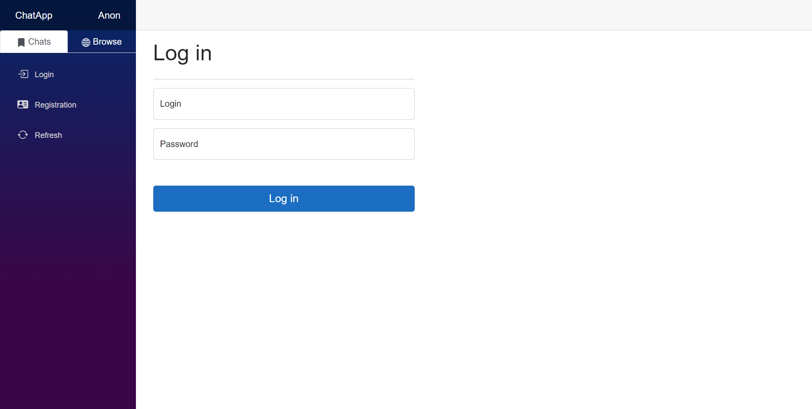
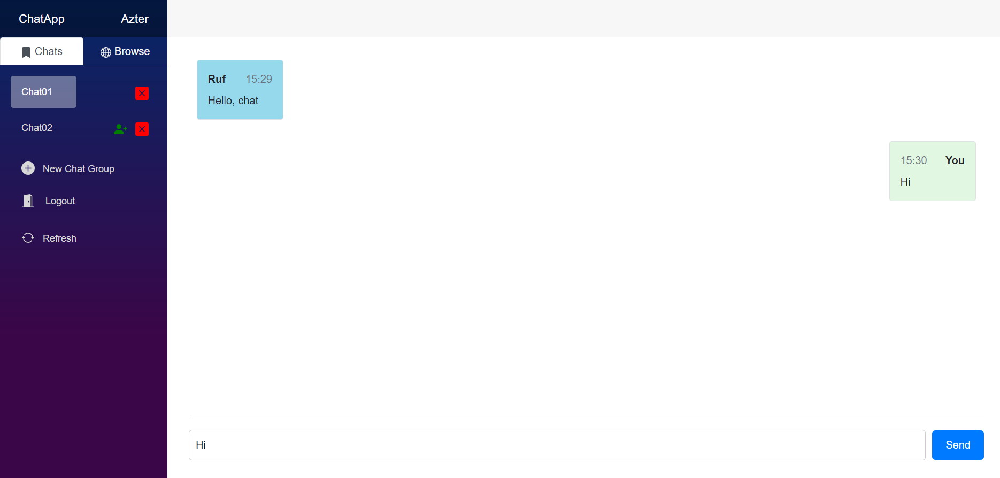
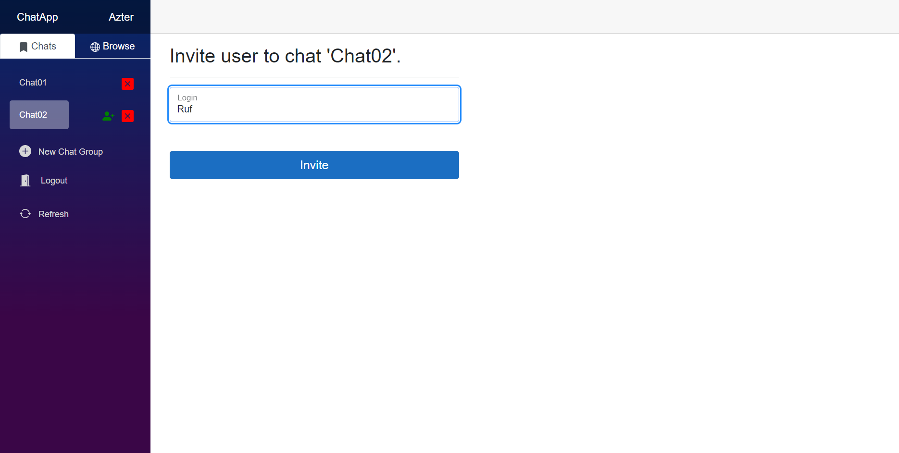
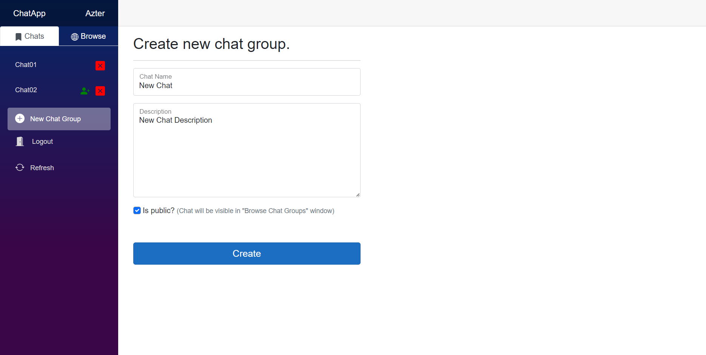
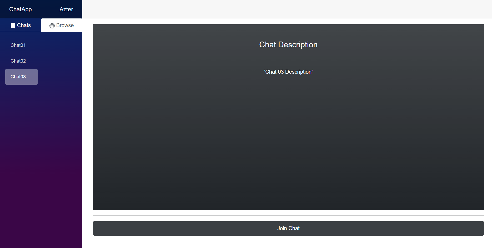

# ChatApp

This chat application is built using ASP.NET Blazor with WebAssembly, providing a fast and responsive user interface that runs entirely in the browser. It leverages SignalR for real-time communication, enabling instant messaging between users without the need for page refreshes. The combination of Blazor and WebAssembly ensures a seamless and interactive experience, while SignalR handles the efficient, bi-directional communication between the client and server.

## How To Launch
1. Make sure you have installe .NET SDK and Entity Framework Core tools globally (`dotnet tool install --global dotnet-ef`).
2. In project folder open OutOfOfficeApp folder and run `dotnet ef database update`. This command will create database and populate it with initial data.
3. Execute application:
   1. Open and execute project with Visual Studio.
   2. Or you can build and run project with `dotnet run` (before this set ASPNETCORE_ENVIRONMENT variable to "Development"  `setx ASPNETCORE_ENVIRONMENT "Development"`).

## Screenshots

### Welcoming page

### Active chat window

### Invitation

### Chat creation window

